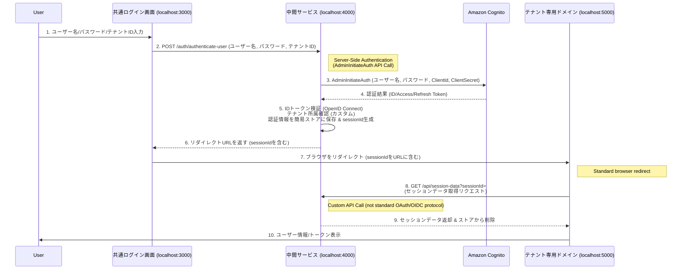

# Cognito + Amplify マルチテナント構成検証環境

## 概要

このプロジェクトは、Amazon CognitoとAWS Amplifyを使用したマルチテナント構成のログイン機能を検証するための環境です。
**CognitoのマネージドログインUI（Hosted UI）を使用せず、ローカルで作成したログイン画面から直接認証を行い、共通のコールバックサービスを介して各テナントアプリケーションに連携する構成**を検証します。

## 構成

```
localhost:3000 - 共通ログイン画面 (React)
      ↓ (POST: ユーザー名, パスワード, テナントID)
localhost:4000 - 中間サービス (Node.js)
      ↓ (Redirect: sessionId)
localhost:5000 - テナント専用ドメイン (React)
```

## AWSコンソールでの作業指示

### 1. Cognitoアプリクライアントの作成 (callback-service用)

`callback-service`はユーザー名とパスワードを受け取り、サーバーサイドでCognitoの認証APIを呼び出すため、クライアントシークレットを持つアプリクライアントが必要です。

1.  **AWSコンソール**にログインし、**Amazon Cognito**サービスを開きます。
2.  **User pools**を選択し、既存のUser Pool（`YOUR_USER_POOL_ID`）を選択します。
3.  左側のナビゲーションメニューから **[App integration]** をクリックします。
4.  **[App clients]** セクションで **[Create app client]** をクリックします。

#### アプリケーションクライアント設定

*   **アプリケーションタイプ**: **`従来のウェブアプリケーション (Traditional web application)`** を選択します。
    *   **重要**: これにより、クライアントシークレットが生成されます。
*   **アプリケーションに名前を付ける**: `callback-service-client` のような識別しやすい名前を入力します。
*   **クライアントシークレット**: **`クライアントシークレットを生成`** のチェックボックスを**オン**にします。
*   **認証フロー**: **`ユーザー名とパスワード (ALLOW_ADMIN_USER_PASSWORD_AUTH) を使用してサインインします`** のチェックボックスを**オン**にします。
*   **OAuth 2.0 許可タイプ**: `Authorization code grant` を**オン**にします。
*   **OpenID Connect スコープ**: `openid`, `email`, `profile` の3つすべてを**オン**にします。
*   **許可されているコールバック URL**: このアプリクライアントはサーバーサイドでCognitoと直接通信するため、ブラウザからのリダイレクトは受けません。ダミーのURL（例: `https://localhost` または `https://example.com/callback`）を設定してください。**このURLが実際に使用されることはありません。**
*   **許可されているサインアウト URL**: ダミーのURL（例: `https://localhost`）を設定してください。

5.  画面下部の **[アプリケーションクライアントを作成]** ボタンをクリックします。

### 2. 作成後の設定値確認

各アプリクライアント作成後、以下の値を確認してください：

*   **User Pool ID**: `YOUR_USER_POOL_ID` (環境固有の値)
*   **callback-service-client の App client ID**: （手順1で作成したクライアントID）
*   **callback-service-client の App client secret**: （手順2で生成されたクライアントシークレット）
*   **Cognito ドメイン**: `https://your-domain-prefix.auth.ap-northeast-1.amazoncognito.com`
    *   **注意**: このドメインは、`callback-service`がJWKSエンドポイントやUserInfoエンドポイントを呼び出すために使用します。

## セキュリティ考慮事項

### 1. 認証フローのセキュリティ

*   **現在の実装**: `login-app`がユーザー名とパスワードを`callback-service`にPOSTし、`callback-service`がサーバーサイドでCognitoの`AdminInitiateAuth` APIを呼び出して認証を行います。これは、OAuth 2.0のResource Owner Password Credentials (ROPC) Grantに似たフローです。
*   **利点**: ユーザー名とパスワード、およびトークンがブラウザに直接露出する機会を最小限に抑えられます。認証の機密性の高い部分はすべてサーバーサイドで行われます。
*   **考慮点**: `AdminInitiateAuth`は管理者権限を必要とするAPIであり、`callback-service`がCognitoユーザープールに対する適切なIAM権限を持つ必要があります。この権限は最小限に絞り、慎重に管理されるべきです。

### 2. トークン連携方法のセキュリティ

*   **現在の実装**: `callback-service`は認証情報を簡易的なインメモリストアに保存し、その`sessionId`をURLパラメータとして`tenant-app`に渡します。`tenant-app`は`sessionId`を使って`callback-service`のAPIを呼び出し、認証情報を取得します。
*   **リスク**: `sessionId`自体は機密情報ではありませんが、URLパラメータとして渡されるため、ブラウザ履歴、リファラーヘッダー、サーバーログなどによる漏洩リスクがあります。`sessionId`が漏洩した場合、有効期限内であれば認証情報が取得されるリスクがあります。
*   **推奨対策**: 本番環境では、`sessionId`をURLパラメータではなく、HttpOnlyかつSecure属性を持つCookieとして設定するか、より堅牢なセッション管理（例: Redis, DynamoDB）と組み合わせるべきです。

### 3. テナント所属確認の仮実装

*   **現在の実装**: `callback-service`内で、ユーザーがログインしようとしているテナントに所属するかどうかを**仮のロジック**で判定しています（`tenant1`は許可、`tenant2`は拒否）。
*   **リスク**: この仮実装は検証用であり、本番環境ではユーザー管理システム（例: データベース、外部API）と連携し、ユーザーの実際のテナント所属情報を確認する必要があります。

### 4. `jsonwebtoken`の`audience`検証の回避

*   **現在の実装**: `callback-service`のJWT検証において、`jsonwebtoken`ライブラリの組み込み`audience`検証機能が期待通りに動作しないため、**手動で`aud`クレームを検証**しています。
*   **注意**: これはライブラリの特定の挙動を回避するための暫定的な措置です。本番環境では、この問題の原因を特定し、ライブラリのバージョン調整や、より堅牢なJWT検証ライブラリの導入を検討することが望ましいです。

## テナント管理

現在の実装では検証のためハードコードしていますが、本番環境では以下の管理方法を推奨します：

```javascript
// 検証用ハードコード（本番ではDB管理を推奨）
const TENANTS = {
  'tenant1': {
    id: 'tenant1',
    name: 'テナント1',
    domain: 'tenant1.example.com',
    redirectUrl: 'http://localhost:5000?tenant=tenant1'
  },
  'tenant2': {
    id: 'tenant2', 
    name: 'テナント2',
    domain: 'tenant2.example.com',
    redirectUrl: 'http://localhost:5000?tenant=tenant2'
  }
};
```

## インストールと起動

### 1. 依存関係のインストール

```bash
# ルートディレクトリで実行
npm install

# 各サービスの依存関係をインストール
cd login-app && npm install && cd ..
cd callback-service && npm install && cd ..
cd tenant-app && npm install && cd ..
```

### 2. 環境変数の設定


#### callback-service/.env

```env
COGNITO_USER_POOL_ID=YOUR_USER_POOL_ID
COGNITO_APP_CLIENT_ID=YOUR_APP_CLIENT_ID
COGNITO_APP_CLIENT_SECRET=YOUR_APP_CLIENT_SECRET
COGNITO_DOMAIN=https://your-domain-prefix.auth.ap-northeast-1.amazoncognito.com
AWS_REGION=ap-northeast-1
PORT=4000
AWS_ACCESS_KEY_ID=YOUR_AWS_ACCESS_KEY_ID
AWS_SECRET_ACCESS_KEY=YOUR_AWS_SECRET_ACCESS_KEY
```

### 3. サービスの起動

#### 個別起動（推奨）

```bash
# ターミナル1: 共通ログイン画面
cd login-app && npm run dev

# ターミナル2: 中間サービス
cd callback-service && npm run dev

# ターミナル3: テナント専用ドメイン
cd tenant-app && npm run dev
```

#### 同時起動

```bash
# ルートディレクトリで実行
npm start
```

### 4. アクセスURL

*   **共通ログイン画面**: http://localhost:3000
*   **中間サービス**: http://localhost:4000
*   **テナント専用ドメイン**: http://localhost:5000

## 認証フロー



1.  ユーザーが `localhost:3000` でテナントを選択し、ユーザー名とパスワードを入力してログイン。
2.  `login-app` がユーザー名、パスワード、テナントIDを `callback-service` の `/auth/authenticate-user` エンドポイントに POST リクエストで送信。
3.  `callback-service` で：
    *   受け取ったユーザー名とパスワードを使用して、サーバーサイドからCognitoの `AdminInitiateAuth` API を呼び出し、認証を実行。
    *   CognitoからIDトークン、アクセストークン、リフレッシュトークンを取得。
    *   IDトークンの妥当性検証（署名、発行者、有効期限、`audience`の手動検証）。
    *   ユーザーのテナント所属確認（仮実装）。
    *   認証情報を簡易ストアに保存し、一意の`sessionId`を生成。
4.  `callback-service` が `tenant-app` へのリダイレクトURL（`sessionId`を含む）を `login-app` に返す。
5.  `login-app` が受け取ったURLにブラウザをリダイレクト。
6.  `tenant-app` がURLから`sessionId`を読み取り、`callback-service`の`/api/session-data`エンドポイントを呼び出して認証情報を取得。
7.  `tenant-app` が取得した認証情報（アクセストークンなど）を表示。

## 検証手順

### 1. AWSコンソールでアプリクライアントを作成後、以下の値を確認

*   **App client ID**: Cognitoコンソールで確認できます
*   **Domain**: 設定したCognitoドメイン

### 2. 環境変数ファイルを作成

上記の「環境変数の設定」セクションを参考に、各サービスの`.env`ファイルを作成してください。

### 3. サービスの起動

#### 個別起動（推奨）

```bash
# ターミナル1: 共通ログイン画面
cd login-app && npm run dev

# ターミナル2: 中間サービス
cd callback-service && npm run dev

# ターミナル3: テナント専用ドメイン
cd tenant-app && npm run dev
```

#### 同時起動

```bash
# ルートディレクトリで実行
npm start
```

### 4. アクセスURL

*   **共通ログイン画面**: http://localhost:3000
*   **中間サービス**: http://localhost:4000
*   **テナント専用ドメイン**: http://localhost:5000

## 動作確認ポイント

*   **テナント1でログイン**: 正常に`tenant-app`にリダイレクトされ、情報が表示される。
*   **テナント2でログイン**: `login-app`に戻り、`unauthorized_tenant_access`エラーが表示される。
*   **ログ確認**: `callback-service`のコンソールログで、各ステップの処理状況を確認。

## 特記事項

### 1. マネージドログインUIの不使用

*   本構成では、CognitoのHosted UIを使用せず、`login-app`でカスタムのログイン画面を実装しています。これにより、デザインの自由度が高まります。

### 2. `callback-service`の役割

*   `callback-service`は、ユーザー名とパスワードを受け取り、サーバーサイドでCognitoの認証APIを呼び出し、認証結果のトークンを処理します。
*   認証後のテナント所属確認、認証情報の簡易ストアへの保存、`sessionId`の発行、そして`tenant-app`へのリダイレクトURLの返却を行います。

### 3. `jsonwebtoken`の`audience`検証の回避

*   `callback-service`のJWT検証において、`jsonwebtoken`ライブラリの組み込み`audience`検証機能が期待通りに動作しないため、**手動で`aud`クレームを検証**しています。
*   `jwt.verify`は署名、発行者、有効期限の検証を行い、その後に`decodedHeader.payload.aud`と`COGNITO_CONFIG.clientId`を比較しています。
*   この挙動はライブラリの特定のバージョンや環境に起因する可能性があり、本番環境では原因究明または代替ライブラリの検討が望ましいです。

### 4. セッションデータ連携のセキュリティ

*   `callback-service`から`tenant-app`への認証情報連携は、`sessionId`をURLパラメータとして渡し、`tenant-app`がAPIコールでデータを取得する方式です。
*   `callback-service`の`sessionStore`は**インメモリの簡易実装**であり、プロセス再起動でデータが失われます。本番環境では**DynamoDBやRedisなどの永続的なストアへの移行が必須**です。
*   `sessionId`のURLパラメータ渡しは、セキュリティリスク（ブラウザ履歴、リファラーヘッダーなど）を伴います。本番環境では、HttpOnly CookieやPOSTリクエストによる連携など、より安全な方法への切り替えを検討してください。

### 5. テナント所属確認の重要性

*   `callback-service`内の`isUserAuthorizedForTenant`関数は、テナント所属確認の**仮実装**です。本番環境では、実際のユーザー管理システム（例: データベース、外部API）と連携し、ユーザーがログインしようとしているテナントに実際にアクセス権限があるかを厳密に確認するロジックを実装する必要があります。

---